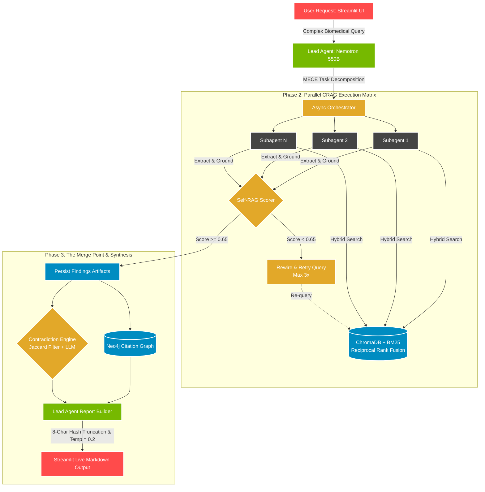

<div align="center">

# 🛡️ PROJECT PROMETHEUS
**CLASSIFIED // CLEARANCE LEVEL: OMEGA**  
*Autonomous Multi-Agent Biomedical Research Engine*

[](https://www.python.org/)
[](https://build.nvidia.com/)
[](https://www.trychroma.com/)
[](https://neo4j.com/)
[](https://streamlit.io/)
[](https://github.com/)
[](https://opensource.org/licenses/MIT)

</div>

---

## 📑 DECLASSIFIED BRIEFING

**Project Prometheus** is a frontier-grade, asynchronous multi-agent AI architecture engineered to autonomously process, evaluate, cross-reference, and synthesize complex scientific and biomedical literature. 

Designed to overcome the critical failure modes of traditional Retrieval-Augmented Generation (RAG) systems—specifically **Contradiction Blindness**, **Loss of Lexical Precision**, **Hallucination**, and **Token Degeneration**—Prometheus deploys a distributed "Lead-Worker" topology. It leverages a dual-tier Mixture-of-Experts (MoE) LLM strategy, a mathematically fused hybrid retrieval pipeline, and a Neo4j-backed Contradiction Engine to deliver academic-grade, verifiable intelligence.

---

## 🏗️ SYSTEM TOPOLOGY & ARCHITECTURE

The following flowchart illustrates the autonomous multi-agent operational matrix, from user query ingestion to final synthesis.



---

## 📡 OPERATIONAL SEQUENCE

The precise sequence of asynchronous operations ensuring hallucination-free generation and rate-limit compliance:

```mermaid
sequenceDiagram
    autonumber
    actor User
    participant UI as Streamlit Web Interface
    participant Lead as Lead Agent (550B)
    participant Orch as Orchestrator (Async)
    participant Sub as Parallel Subagents (120B)
    participant DB as Hybrid Retrieval
    participant Scorer as CRAG Scorer (120B)
    participant CE as Contradiction Engine

    User->>UI: Submit high-stakes query
    UI->>Lead: Initiate Directive
    Lead->>Lead: Decompose into 4 MECE tasks
    Lead->>Orch: Dispatch task JSON array
    
    rect rgb(40, 44, 52)
    Note right of Orch: Concurrent Execution Loop (Semaphore Capped)
    loop For Each Subagent Task
        Orch->>Sub: Initialize Worker
        Sub->>DB: Execute Dense + Sparse Fusion Search
        DB-->>Sub: Return Top-K Ranked Documents
        Sub->>Scorer: Validate Grounding (0.0 - 1.0)
        alt Score < 0.65
            Scorer->>Sub: Trigger Rewrite & Retry
        end
        Sub-->>Orch: Persist Validated JSON Findings
    end
    end

    Orch->>CE: Merge all JSON findings
    CE->>CE: Run Jaccard Similarity Filter
    CE->>CE: LLM identifies High/Med/Low Conflicts
    CE-->>Lead: Pass conflict matrix & merged data
    Lead->>UI: Stream final synthesized report
    UI-->>User: Render verified Markdown + Citations
```



---

## 🛡️ THREAT MITIGATION & ARCHITECTURAL DEFENSES

Prometheus is engineered to neutralize the 4 critical failure modes inherent in standard Generative AI pipelines:

### 1. Contradiction Blindness
* **Vulnerability:** Standard RAG pipelines ingest conflicting papers and hallucinate a false, averaged-out consensus.
* **Defense:** **The Contradiction Engine**. Claims are cross-referenced using Jaccard Similarity to isolate overlapping topics. The LLM then performs side-by-side logical evaluations to explicitly flag scientific disagreements (High/Medium/Low severity) and forces a dedicated "Conflicting Evidence" section in the final report.

### 2. Lexical Precision Loss
* **Vulnerability:** Dense vector embeddings (ChromaDB) excel at conceptual matching but fail to retrieve exact drug codes or genetic mutations (e.g., `C797S`, `BTX-6654`).
* **Defense:** **Hybrid Retrieval via RRF**. Parallel querying of a dense Vector Store (ChromaDB) and a sparse Keyword Store (Rank-BM25). Results are mathematically fused using Reciprocal Rank Fusion to ensure zero loss of critical medical nomenclature.

### 3. Hallucination & Evidence Fabrication
* **Vulnerability:** Monolithic RAG trusts retrieved context blindly, leading to ungrounded generation if search results are poor.
* **Defense:** **Self-Reflective Corrective RAG (CRAG)**. A dedicated `SelfRAGScorer` agent strictly evaluates the grounding of every extracted claim. Any evidence scoring below `0.65` is rejected, triggering an automatic query rewrite and retry sequence.

### 4. Token Degeneration Loops
* **Vulnerability:** Tracking academic papers via 64-character SHA-256 hashes traps high-temperature LLMs in predictive hex loops (e.g., infinite `4f4f4f...`).
* **Defense:** **Structural Truncation & Calibration**. The Data Aggregator truncates 64-character hashes to clean, 8-character short-IDs. Temperature is locked to `0.2` during Phase 3, keeping the 550B synthesizer deterministically focused on Markdown generation.

---

## ⚙️ CORE TECH STACK

| Subsystem | Technology | Purpose |
| :--- | :--- | :--- |
| **Primary Intelligence** | `nvidia/nemotron-3-ultra-550b` | Complex MECE Decomposition & Report Synthesis |
| **Worker Intelligence** | `nvidia/nemotron-3-super-120b` | High-throughput CRAG scoring & data extraction |
| **Dense Retrieval** | ChromaDB + `all-MiniLM-L6-v2` | Semantic concept matching & embedding storage |
| **Sparse Retrieval** | Rank-BM25 (`BM25Okapi`) | Exact-match biomedical keyword lookups |
| **Knowledge Graph** | Neo4j | Citation mapping & relational overlap detection |
| **Concurrency** | Python `asyncio` | High-speed, rate-limit safe orchestrator |
| **Dashboard** | Streamlit | Asynchronous real-time token streaming |

---

## 🚀 DEPLOYMENT DIRECTIVES

### Prerequisites
* Python 3.10+
* NVIDIA API Key (Build program)
* Neo4j instance (Local or AuraDB)

### 1. Initialize Local Environment
```bash
git clone https://github.com/NukaNarendra/Prometheus.git
cd Prometheus

python -m venv .venv
# Activate virtual environment
source .venv/bin/activate  # Unix/macOS
.venv\Scripts\activate     # Windows

pip install -r requirements.txt
```

### 2. Configure Environment Secrets
Create a `.env` file in the project root:
```env
NVIDIA_API_KEY="your-nvidia-api-key-here"
NEO4J_URI="bolt://localhost:7687"
NEO4J_USER="neo4j"
NEO4J_PASSWORD="your-secure-password"
PROMETHEUS_MODE="prod"
```

### 3. Ignite the Pipeline
```bash
streamlit run app/streamlit_app.py
```

---

<div align="center">
  <i>"Replacing monolithic hallucination with multi-agent verification."</i>
</div>
